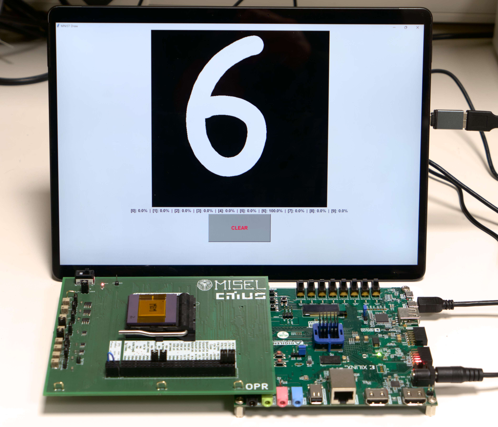

# HO-MNIST
Hardware Oriented CNN for MNIST recognition.




## Online demo
You can try an online simulation of our CIM macro! [](https://mybinder.org/v2/gh/citiususc/ho-mnist/HEAD?labpath=Demo.ipynb) [](https://colab.research.google.com/github/citiususc/ho-mnist/blob/master/Demo.ipynb) <a href="https://github.com/codespaces/new?hide_repo_select=true&ref=main&repo=citiususc/ho-mnist&machine=basicLinux32gb&location=WestEurope"></a>


## Creation of the Hardware Oriented model

### Train model
```shell
python3 ./train.py --output-path=./models/mnist_base.pth
```

### Quantize model
```shell
python3 ./quantize.py --model-path=./models/mnist_base.pth --output-path=./models/mnist_quantized.pth
```

### Convert model to int8 and store scales
```shell
python3 ./convert.py --model-path=./models/mnist_quantized.pth --output-path=./models/mnist_quantized_converted.pth
```


## Visualization of the 5-bit kernels
```shell
python3 ./display_weights.py --model-path=./models/mnist_quantized_converted.pth --chip-format
```


## Testing of the model
```shell
python3 ./test.py --test-base --model-path=./models/mnist_base.pth  # Accuracy: 97.56%
python3 ./test.py --model-path=./models/mnist_quantized_converted.pth  # Accuracy: 90.57%
python3 ./test.py --test-hardware --model-path=./models/mnist_hacc --serial-port=/dev/ttyUSB2  # Accuracy: 91.89%
```


## Live demo
```shell
python3 ./demo.py --model-path=./models/mnist_quantized_converted.pth --live
python3 ./demo.py --hardware --model-path=./models/mnist_hacc --serial-port=/dev/ttyUSB2 --live
```

